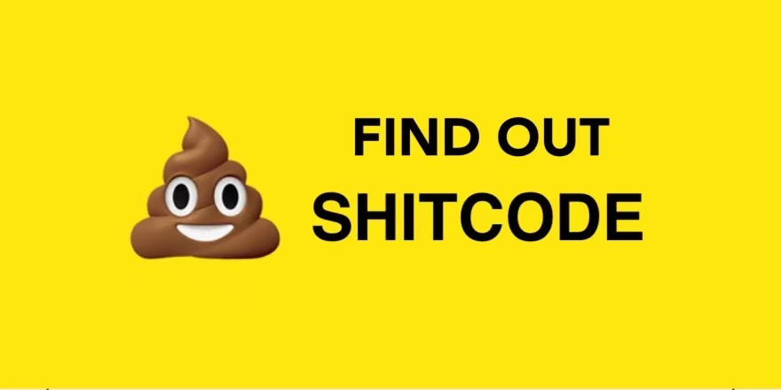
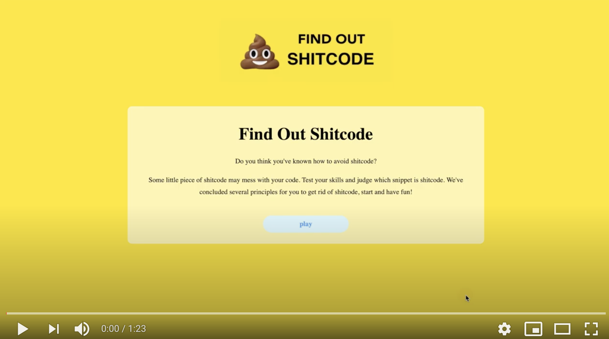

# Find Out Shitcode

A quiz challenge aimed to help new coders get rid of bad coding habit in a playful way. Find out bad coding practice from the listed coding snippets. Watch out 💩 on the screen if you choose wrong answers. We’ve concluded several good coding principles for you to build up a better awareness of how to avoid writing shitcode.

    <a href="#_team">1. Team</a>&nbsp;&nbsp;&nbsp;|&nbsp;&nbsp;
    <a href="#_intro">2. Introduction</a>&nbsp;&nbsp;&nbsp;|&nbsp;&nbsp;
    <a href="#_background">3. Background and Motivation</a>&nbsp;&nbsp;&nbsp;|&nbsp;&nbsp;
    <a href="#_implementation">4. System Implementation</a>&nbsp;&nbsp;&nbsp;|&nbsp;&nbsp;
    <a href="#_UX">5. UX Design</a>&nbsp;&nbsp;&nbsp;|&nbsp;&nbsp;
    <a href="#_sprints">6. Sprints & Project Management</a>&nbsp;&nbsp;&nbsp;|&nbsp;&nbsp;
    <a href="#_evaluation">7. Evaluation</a>&nbsp;&nbsp;&nbsp;|&nbsp;&nbsp;
    <a href="#_conclusion">8. Conclusion</a>

## 1.  Team

Zhennan Xiang: <oh20840@bristol.ac.uk> [Backend, System architect]

Shujie Liu: <xk20359@bristol.ac.uk> [Backend]

Karine Liang: <eb20033@bristol.ac.uk> [Frontend]

Sheng Guo: <ka20939@bristol.ac.uk> [Frontend]

Shengzhe Qin: <fb20957@bristol.ac.uk> [Frontend]

## 2.  Introduction
Find-out-shitcode is a quiz game designed for coders especially novices to improve their coding habit and learn how to write elegant code. Good habits for coding are important when learning programming as well as coding in a team. New coders always feel confused about which is good practice for implementing a piece of code. There are many tutorials on the market that teach you how to write code, but few teach you how to avoid writing shit code. The game is aimed at this kind of niche market and offered in a playful way to make learning more fun.

Based on [state-of-the-art-shitcode](https://github.com/trekhleb/state-of-the-art-shitcode) principles, each question provides two code snippets with examples of good and bad style in the game. The user is encouraged to distinguish between them and choose the bad one which is defined as shitcode. The corresponding principle for good coding practice will be displayed afterwards. To increase the challenge of the game, the user will get report and ranking at the end.

A checklist against which our team could evaluate the success of our project is [here](portfolio/Conclusion/README.md/#_2.1).

### Demo video

## 3.  Background and Motivation

[Click here](portfolio/Background/README.md) to see:

a. Background literature and academic research review

b. State of the art survey and current industry review

c. Definition and challenge of the problem

## 4.  System Implementation

[Click here](portfolio/System_implementation/README.md) to see:

a. Stack architecture and system design

b. Back End - MongoDB - database implementation

c. Middle Tier - Express, Node, the RESTful API

d. Front End - Angular

e. Additional element - cookie/session or local storage

f. Deployment details - Docker

## 5.  UX Design
[Click here](portfolio/UX/README.md) to see:

a. Early prototyping and ideation

b. Identification of interacting users and broader stakeholders

c. UX approach

d. Understanding of user group

e. Wireframes and interaction flow diagrams for final key subsystems

## 6.  Sprints & Project Management
[Click here](portfolio/Sprints/README.md) to see:

a. Group working methods

b. A summary of team roles and individual contributions

c. Documentation of sprints

d. Team use of Git - continuous integration and deployment

## 7.  Evaluation

[Click here](portfolio/Evaluation/README.md) to see:

a. Details of evaluation of our design

b. Unit testing / Functional testing

c. User acceptance testing

## 8.  Conclusion

[Click here](portfolio/Conclusion/README.md) to see:

a. Conclusion on working practices of the group

b. Conclusion on success of the project

c. How coronavirus has affected the project

d. Social and Ethical implications

e. Future work
