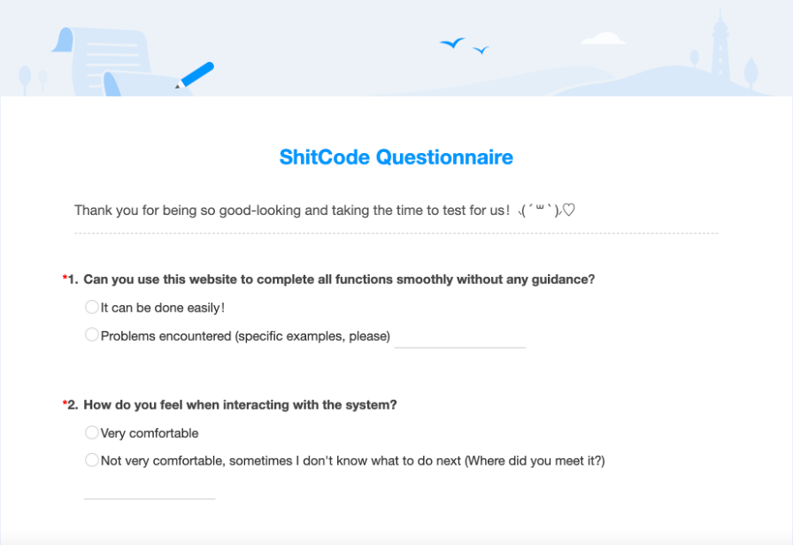
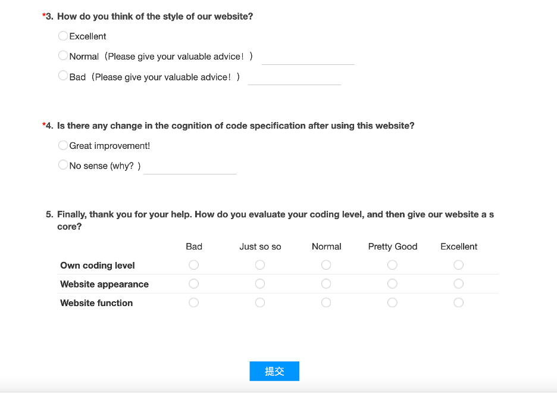
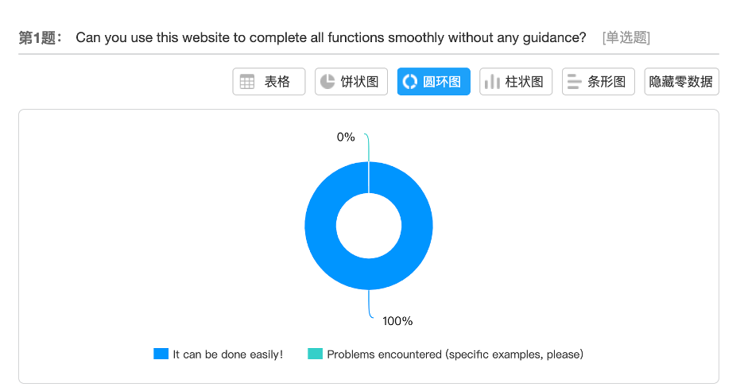
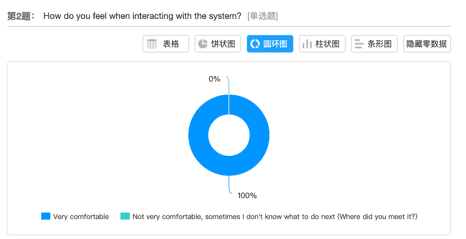
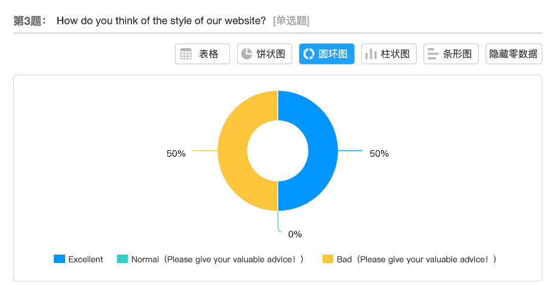
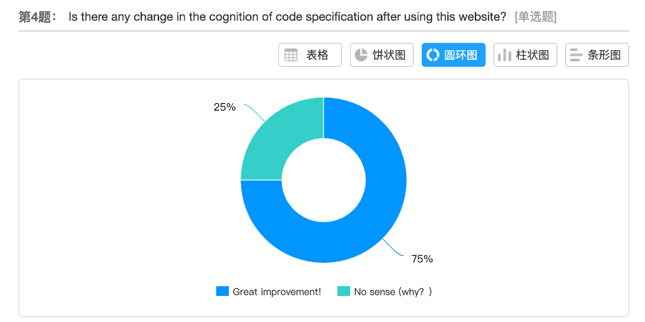
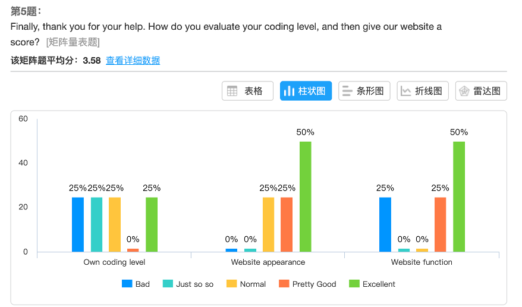

# Evaluation

## Contents

* [1. Details of evaluation of our design](#_1)
    * [Techniques used & awareness of their limitations](#_1.1)
    * [A timeline of evaluation of our design](#_1.2)

* [2. Unit testing / Functional testing](#_2)
    * [API testing with python](#_2.1) 
    * [Test plan for frontend page and function](#_2.2)   

* [3. User acceptance testing](#_3)
    * [Cognitive walk-through](#_3.1)     
    * [Questionnaire design](#_3.2)   
    * [Feedback analysis](#_3.3) 
    * [Conclusion on user testing](#_3.4) 

<a name="_1"></a>
## 1. Details of evaluation of our design

First we will describe the techniques we used and evaluate if they are suitable for our particular design.

<a name="_1.1"></a>
### - Techniques used & awareness of their limitations

* **MEAN stack**<br/>
  Our team strictly follow the recommended technical stack, and as we design, implement and test our application, we find it is truly the most appropriate one. Have a look at our application, we can find that it is a front-end-leading project. Therefore, we need a strong frontend framework to support fast-developing and a relatively simple backend framework to deal with requests. Angular and Express, in the end, serve quite well. As will be discussed in future work section, the good part of express can be a weakness when the website grows, but currently for a SPA web page, it is the best chance.
  
* **MongoDB vs. relational database**<br/>
  We have a simple and clear data model for database part. Since the web application always treat visitors as anonymous guests, we are not expecting the database to hold username or passwords. Also, the web application contains only one function that is a quiz game, which makes non-relational database a better choice over relational ones like MySQL.

<a name="_1.2"></a>
### - A timeline of evaluation of our design

Under the guidance of workbook, we follow the workflow as below.
* **Unit testing timeline** (roughly from the beginning of TB2 to the middle of Easter vacation)<br/>
For separated implementing stage, frontend team members pull from “frontdev”, implementing their own part of work and executing unit tests, then push it back to frontdev, and backend team did similar thing with “xzn” branch.
* **Functional testing** (during Easter vacation until 23rd April)<br/>
After integrating the frontend and backend, all team members pull from “dev”, execute functional tests and push back. At this stage, some changes are made based on testing.
* **User acceptance testing** (23rd April onwards)<br/>
At this stage, only a little changes are made based on testing. After first round of user testing (23rd April), “dev” branch is merged into “main” for the first time, but still, some bug fixing remain in “dev” branch.
* Final push to “main” to form a completed project and report after bug free in “dev” branch.

</br>

<a name="_2"></a>
## 2. Unit testing / Functional testing

Testing happens along with developing. Some details are introduced in the system implementing part.

<a name="_2.1"></a>
### - API testing with python
For integration test, since we only have three APIs to test and logic behind those requests is easy, our team decided to use python scripts to automatically test APIs. The basic idea is to use assert to check the contents of responses. For example, to test the post request which updates history info in MongoDB, we sent a mock get request to localhost before and after post request, then we check the history info to see if historyAnswerNum increased by one. You can refer to the part of code as below.

```javascript
response = requests.post(url, data=json.dumps(data), headers={"Content-Type": "application/json"})
assert (response.text == 'ok')
response = requests.get(questionUrl + "1").text
// after a post request
afterPost = requests.get(questionUrl + "1").text
answerNumAfter = json.loads(afterPost)['historyAnswerNum']
answerCorrectNumAfter = json.loads(afterPost)['historyCorrectNum']
assert (answerCorrectNumAfter == answerCorrectNumBefore + 1)
assert (answerNumAfter == answerNumBefore + 1)
```

<a name="_2.2"></a>
### - Test plan for frontend page and function
We create this web application, hoping that users can test their knowledge of code quality and raise their awareness on good coding practice at the end.

**Access to our website**</br>
- Make sure that user's network is good and that they can access our website through a browser.
- We use Google Chrome, Firefox, Safari, QQ browser to test, to ensure that users can access through these browsers.

**Welcome page**</br>
- Images on page load correctly.
- The text of the page is displayed correctly.</br>
*Find Out Shitcode*</br>
*Do you think you've known how to avoid shitcode?
Some little piece of shitcode may mess with your code. Test your skills and judge which snippet is shitcode. We've concluded several principles for you to get rid of shitcode, start and have fun!*
- The `play` button works. Click `play` button and jump to the question page to start the quiz.

**Question page**</br>
- Options can be displayed correctly on the page.
- The option box selected by user will be highlighted.
- Select one option and click `confirm` button to check the answer.
- When a user clicks on the `confirm` button without selecting an option, a pop-up window will show up to give a reminder.
- The answer page shows right option with highlighted effect and percentage of people who answered the question correctly.
- Click `next` button to go to the next question.
- Click `get report` button to enter the report page and get result.

**Report page**</br>
- The result can be displayed correctly.</br>
-- If a user's accuracy is more than 80%, the image of happy shit icon will be displayed along with the text "You may not be a master of shitcode, but guess what, you can be a good coder!".</br>
-- If a user's accuracy is between 60% and 80%, the image of normal shit icon will be displayed along with the text .</br>
-- If a user's accuracy is below 60%, the image of sad shit icon will be displayed along with the text "Congratulations, you were born to be a shitcode writer!".
- If the user click `home` button to return to the welcome page.
- If the user click `review answers` button to return to the question page, where the answer of each question could be checked.
- If the user click `replay` button to restart the game, a new round of game will start and the previous records will be cleared.

The test plan is to ensure all of the core frontend functions will be tested and the interaction with backend will work properly.

</br>

<a name="_3"></a>
## 3. User acceptance testing

Good thing about user acceptance testing for our web application is all our classmates of MSc computer science program can be a member of potential user. They have learnt some basic knowledge and skills about coding but are not professional enough or experienced enough, very close to target user of this web application.

We introduced user testing in each cycle of our sprints. But the first several sprints only involved small-scale tests which focused on our key users. Check user stories of each sprint for detail. The massive user acceptance test was taken on 23rd April onwards. Three stages were set for the testing, which are cognitive walk-through, questionnaire design and feedback analysis. 

<a name="_3.1"></a>
### - Cognitive walk-through
First, we want the user to do what is called cognitive walk-through. In this stage, users are given no guidance for exploring the whole web application so they will have to read the sentences on the page and try any buttons they can see. In this way, we can get useful feedbacks about how well we designed the UX.

<a name="_3.2"></a>
### - Questionnaire design
Second, we want users to comment on the real content of the web application. In our case, it is how they feel about the importance of code quality after playing the quiz game.
An online survey of four multiple-choice questions is designed to collect advice as well as complaints, in order to help us understand and analyze feedback from users. 

The first draft of the questionnaire is shown as below.

```
Can you manage to finish the whole quiz without any help from developers?
a.yes   b.met some problems
How do you feel about the quiz process?
a.easy to explore  b.not good, sometimes I get lost
How do you feel about the style of the website?
a.good  b.ugly
Do you think this website help raise your awareness of the importance of code quality?
a.yes    b.no
```

The final online version is shown as below.




<a name="_3.3"></a>
### - Feedback analysis

We get approximately 50 valid feedbacks from our users.

For the first and second questions of the questionnaire, the satisfaction is 100%, which proves that there is no problem with the guidance and interaction of the web application.




For the third question, 50% of the users choose excellently, and 50% choose poorly. The main reason is that the reading effect is not ideal. This is the next part we need to improve to make the whole web application more readable. 



For the feedback of the fourth question, 75% of the users feel that they have improved, and 25% of the users feel that they have not. The reasons are very diverse. It is possible that some users have a deep understanding of coding principles so that they have less demand to learn from our web application.
However, in general, the help of our web application to users is significant.



For the last question of the questionnaire, the acceptance of our web application is high, but 25% of the people think that the function is not good enough. 



<a name="_3.4"></a>
### - Conclusion on user testing

* The majority of users think the web application is easy to explore and all of them manage to finish the quiz. This is a strong proof of the success of UX design. 
* Half of the users think that the style of the web application is not good enough.
* Over 75% of the users have realized the big difference between good code and shit code through the game, and willing to pay more attention to code quality afterwards.
* Around 50% of the users think it is a playful game.

The web application is originally designed to help new coders to realize how important code quality is. Therefore, despite of some complaint about our UI design (did our best), we think it meets our initial expectations. Besides, some people are actually getting fun from it, which meets the target that is “to design a playful web application but also to deal with serious problem”. 

</br></br>

[Back to the homepage](../../README.md)
