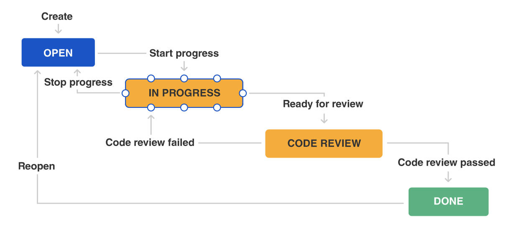
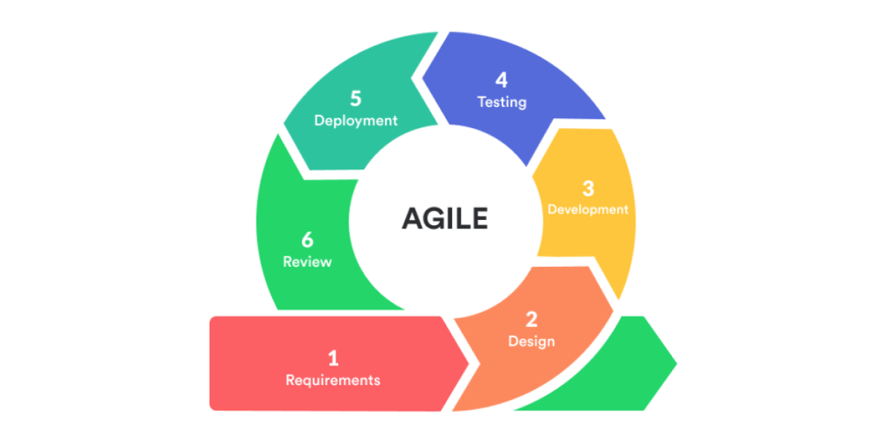

# Sprints & Project Management

## Contents

* [Group working methods](#_group)
    * [Workflow](#_workflow)
    * [Agile development](#_agile)
    * [Communication channel](#_communication)

* [A summary of team roles and individual contributions](#_team)
    * [Zhennan Xiang](#_Xiang)

* [Documentation of sprints](#_sprints)
    
* [Team use of Git - continuous integration and deployment](#_git)
    

## Group working methods

To develop an application in a group, we apply the principles of DevOps and stick to the selected methodology to keep out project on track and moving at a constant pace.

### - Workflow
We take an iterative approach to workflow management and break down larger issues into smaller units of work to help us meet our goals faster. Our workflow includes the following four states.
* **TO DO** 
  Work that has not been started
* **IN PROGRESS** 
  Work that is actively being looked at by the team
* **CODE REVIEW** 
  Work that is completed and awaiting review
* **DONE** 
  Work that is completely finished and meets the team's definition of done

### - Agile development

By contrasting the different models for software development, we decide to go for the Agile approach to develop application in incremental and rapid cycles. 
Following Agile model, we decide what can be accomplished in the timeframe at the beginning of a sprint and sets out to build a series of features, deliver working software that can be installed in a production environment at the end of the sprint, which meets the demand for faster software development.

The key development activities we take in the Agile development including:
* **Requirements** - Define the requirements for the iteration based on the application backlog and stakeholder feedback.
* **Design** - Work with stakeholders to define requirements and new features when the application has been identified. 
* **Development** - Start working on the project, which aims to deploy a working application. The application will undergo various stages of improvement and comprise of simple, minimal functionality.
* **Testing** - Unit testing, functional testing, user acceptance testing.
* **Deployment** - Integrate and deliver the working iteration into production.
* **Review** - Accept user and stakeholder feedback and work it into the requirements of the next iteration.

### - Communication channel

* **Teams** - We use Teams to have our weekly meeting and schedule team standups.
* **GitHub** - We use GitHub to share documents, implement version control and merge our outputs for effective collaboration.
* **Kanban** - We use Kanban Board for task allocation and progress monitoring. It makes the progress of our project transparent and helps us more better monitor how far we've come and what's left to do.

## A summary of team roles and individual contributions

* **Zhennan Xiang**

Xiang's role in this team is more focused on technical side and project structure. Since early stage when idea of website was set, I began to design and document the essential frontend components, backend APIs and data models.

To be specific, Xiang has done the following things:
1)	API documenting
2)	component listing
3)	first version of prototype website (including only static json in backend and router in frontend)
4)	database building and integrating
5)	testing and evaluation 

* **Shujie Liu**

## Documentation of sprints

## Team use of Git - continuous integration and deployment
