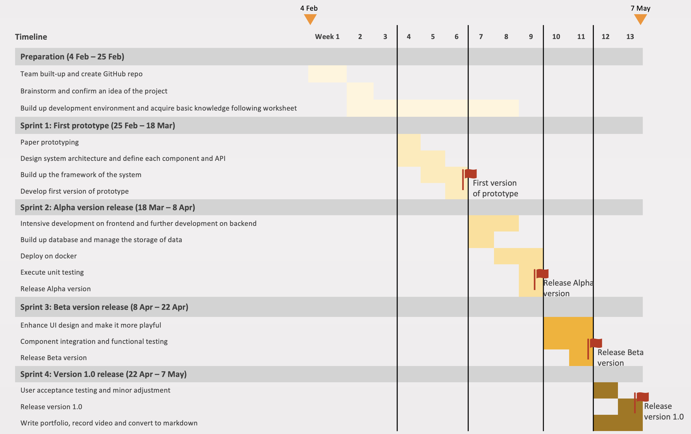
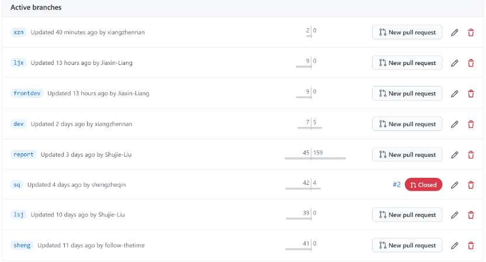

# Sprints & Project Management

## Contents

* [1. Group working methods](#_group)
    * [Workflow](#_workflow)
    * [Agile development](#_agile)
    * [Communication channel](#_communication)

* [2. A summary of team roles and individual contributions](#_team)
    * [Zhennan Xiang](#_Xiang)
    * [Shujie Liu](#_Liu)
    * [Sheng Guo](#_Guo)
    * [Karine Liang](#_Liang)
    * [Shengzhe Qin](#_Qin)

* [3. Documentation of sprints](#_sprints)
    * [High level overview](#_s1)
    * [Timeline](#_s2)
    * [Sprint 1: First prototype (25 Feb – 18 Mar)](#_s3)
    * [Sprint 2: Alpha version release (18 Mar – 8 Apr)](#_s4)
    * [Sprint 3: Beta version release (8 Apr – 22 Apr)](#_s5)
    * [Sprint 4: Version 1.0 release (22 Apr – 7 May)](#_s6)
    * [Meeting logs](#_s7)
    
* [4. Team use of Git - continuous integration and deployment](#_git)
    

## 1. Group working methods

To develop an application in a group, we apply the principles of DevOps and stick to the selected methodology to keep out project on track and moving at a constant pace.

### - Workflow
We take an iterative approach to workflow management and break down larger issues into smaller units of work to help us meet our goals faster. Our workflow includes the following four states.
* **TO DO** 
  Work that has not been started
* **IN PROGRESS** 
  Work that is actively being looked at by the team
* **CODE REVIEW** 
  Work that is completed and awaiting review
* **DONE** 
  Work that is completely finished and meets the team's definition of done

### - Agile development

By contrasting the different models for software development, we decide to go for the Agile approach to develop application in incremental and rapid cycles. 
Following Agile model, we decide what can be accomplished in the timeframe at the beginning of a sprint and sets out to build a series of features, deliver working software that can be installed in a production environment at the end of the sprint, which meets the demand for faster software development.

The key activities we follow during each Agile development cycle are as below: 
* **Requirements** - Define the requirements for the iteration based on the application backlog and stakeholder feedback.
* **Design** - The team discusses how to tackle these requirements, and proposes the tools needed to achieve the best result. The developers discuss the feature implementation and the internal structure of the outcome.
* **Development** - Start working on the project, which aims to deploy a working application. The application will undergo various stages of improvement and comprise of simple, minimal functionality.
* **Testing** - Unit testing, functional testing, user acceptance testing.
* **Deployment** - Integrate and deliver the working iteration into production.
* **Review** - Accept user and stakeholder feedback and work it into the requirements of the next iteration.

### - Communication channel

* **Teams** - We use Teams to have our weekly meeting and schedule team standups.
* **GitHub** - We use GitHub to share documents, implement version control and merge our outputs for effective collaboration.
* **Kanban** - We use Kanban Board for task allocation and progress monitoring. It makes the progress of our project transparent and helps us more better monitor how far we've come and what's left to do.
 

## 2. A summary of team roles and individual contributions

**Zhennan Xiang**

Xiang's role in the team is more focused on technical side and project structure. Since early stage when idea of website was set, I began to design and document the essential frontend components, backend APIs and data models.

To be specific, Xiang has done the following things:
- API documenting
- component listing
- backend development and first version of prototype website (including only static json in backend and router in frontend)
- database building and integrating
- testing and evaluation

**Shujie Liu**

Liu's role in the team is a organiser and communicator， working on hosting weekly meeting, coordinating works and communication among teammates and controlling the progress of the project. She participated in the development of the backend and was mainly responsible for the implementation of report API and related features.

To be specific, Liu mainly contributed to the following things:
- part of backend development
- UX design including paper prototyping and understanding of user group
- project management
- report integration and quality control

**Sheng Guo**

Guo works on frontend and mainly takes responsibility for the three components on question page which are `principle`, `option` and `status-bar`. He is in charge of the implementation and testing of these functions and features.

**Karine Liang**

Liang's role in the team is mainly as a developer in the frontend.

To be specific, she have done the following thing:
-	Frontend development in question component
-	UI design
-	Some help with test
-	Image resources collection
-	Some help when merging other components

**Shengzhe Qin**

Qin's role in the team is more inclined to the front-end page design and peripheral system building assistance.
Qin participated in the specific function design on the initial creative stage of the website, responsible for development and style design of welcome and report pages. Qin also designed the questionnaire and collected user feedback for analysis during the evaluation phase.

Specifically, Qin mainly contributed to the following things:
- Initial creativity
- Part of function design
- Design for welcome page and report page
- Research on font and image library and providing suitable options
- Designing questionnaire and analyzing user feedback for evaluation
 

## 3. Documentation of sprints

### - High level overview
As mentioned above in our system implementation we decided on the agile approach which features breaking down of project into sprints.

At the beginning of each sprint, we decided the features that we would implement during that sprint, the tests that we expected each subsystem to pass, and the user stories that we expected to be satisfied by the implementation of those features.

During each iteration we defined the requirements based on the backlog from previous sprints, and test user feedback. We then designed the software based on the requirements. Finally, we evaluated our previous version before defining the requirements for the next sprint.

### - Timeline

### - Sprint 1: First prototype (25 Feb – 18 Mar)

| Agile development cycle I  | Description      | 
| ------------------------ | ---------------- |
| Requirements    | Defined overall infrastructure; Defined minimum viable product (MVP) with functions/classes/variables; Develop first prototype and make it work;     | 
| Design          | Paper prototyping and draw website wireframes; Design Angular components of each page [(Click here to check)](../System_implementation/README.md#_list); Design RESTful API [(Click here to check)](../System_implementation/README.md#_api);     |  
| Development     | Implement Node.js server, create question API; Build framework of components of welcome page, question page and report page with only text description, necessary buttons but no style; |
| Testing         | Test question API on Express with `node server.js`; |
| Deployment      | Deploy on local [(Click here to check video of first prototype)](https://youtu.be/6PBFm8z1YCs) |
| **Users stories**   | **Emma (End-user)**: I only saw some buttons to click to jump to different pages. There is only one question. I had no idea how to play with it. The interface looks too plain though. It is only a simple web page with some texts and buttons. |
| Review          | Backlog and things to do: Develop on front-end to make it more functional and interactive; Build up database to store related data; Work on the two more APIs by further development on back-end |
 

### - Sprint 2: Alpha version release (18 Mar – 8 Apr)

| Agile development cycle II  | Description      | 
| ------------------------ | ---------------- |
| Requirements    | Fulfill functionality of each component on frontend; Develop report API and submit API; Build up database on backend; Implement deployment on docker     | 
| Design          | List implementation detail of each component and internal logic on fulfilling each functionality; Design database model and schema, decide what data to store and how to store it;|  
| Development     | Implement integrated development on frontend; Work on the development of two more APIs on backend; Create a service to handle the http calls and connect components to APIs; Implement MongoDB and manage the storage of data |
| Testing         | Execute unit testing |
| Deployment      | Deploy on docker [(Click here to check video of Alpha version)](https://youtu.be/Z3gb-ht5-jM) |
| **Users stories**   | **Emma (End-user)**: I can see what the system looks like and what I can do with it, although the UI design is not pretty. There are several questions now. I'm willing to have a try and play with it, however, the whole experience looks like taking a test. I don't enjoy it or feel it playful. |
| Review          | Backlog and things to do: Enhance UI design and make it more playful; Design the welcome page and introductory text of the game; Work on report page to make the game more competitive |
 

### - Sprint 3: Beta version release (8 Apr – 22 Apr)

| Agile development cycle III | Description      | 
| ------------------------ | ---------------- |
| Requirements    | Improve UI design and embellish the webpages; Design welcome page and report page, implement get-report feature; Adjust setting and logic of the buttons on question page     | 
| Design          | Find out suitable design materials, e.g. images, logo; UI design: 1) Background and theme color of the webpages; 2) Design of navigation bar; 3) The format of the codes displayed in the option box; 4) Design the page rendering after the user selects an answer; 5) Design the display details of correct answer  Add a "next" button on question page; Decide what data to show on the report page|  
| Development     | Develop on welcome page and report page; Improve UI design on question page |
| Testing         | Component integration and functional testing |
| Deployment      | Deploy on docker [(Click here to check video of Beta version)](https://youtu.be/5RtuafF8Iko) |
| **Users stories**   | **Emma (End-user)**: When I open the website again, it is colorful and vivid. The user interface looks more like a playful game now. It make me want to explore the game more. However, the font of some texts is too small to read. Besides, the option box and the content in it could be designed more user-friendly. |
| Review          | Backlog and things to do: Further adjustment on UI design according to user's feedback; User acceptance testing; Write portfolio, record demo video |
 

### - Sprint 4: Version 1.0 release (22 Apr – 7 May)

| Agile development cycle IV | Description      | 
| ------------------------ | ---------------- |
| Requirements    | Further adjustment on UI design and other minor adjustment; Fix some errors on the pages and in the codes; Write portfolio, record demo video| 
| Design          | Find out several font libraries to choose; UI design: 1) Increase font size of some texts; 2) Change font and color of some texts; 3) Highlight the selected option box; 4) Resize the option box; Design questionnaire for evaluation, collect and analyse feedback from users|  
| Development     | Work on some minor adjustment on UI design; Fix bugs and deploy for user acceptance testing|
| Testing         | User acceptance testing |
| Deployment      | Deploy on docker [(Click here to check video of version 1.0)](https://youtu.be/2qxE9Px6Q80) |
| **Users stories**   | **Emma (End-user)**: I think the final version is great. It's a playful quiz game. I can learn something about which is shitcode that I should avoid in the future but also have much fun in the process. I will recommend the game to my coder friends. There are only ten questions in the game for now, short and easy to be focused. However, it would be better for coding beginner if the question database could be more abundant and set the challenge into different levels for players to choose. |
| Review          | Make project conclusion on each aspect|
 

### - Meeting logs

We held a total of 19 online meetings in the whole process of the project. [Click here](meeting_log/README.md) to check our integrated meeting logs.
  

## 4. Team use of Git - continuous integration and deployment

To control and manage development in a robust and systematic way, we implement version control using a public GitHub repo and setup main, dev and other feature branches. Each team member developed their codes locally and pushed them to their own individual dev branch when code is finalized and they are happy with it. These individual branches were updated by each team member and were a working, moving copy of the latest shared version of their code.

Because the frontend development work was allocated to three persons, the frontend team integrated their work by merging all changes to frontdev branch. Then frontend and backend working copies were merged to dev branch regularly whenever we completed a significant set of proper unit tests and functional tests. 

Here is a screen shot of all branches of the GitHub repo. All five members has their own personal branch, and there is a `frontdev` for frontend team to push and pull, `dev` for staging release version, and `main` branch for final version. 

Our principle is to merge code progressively from branch to branch. One group member of our team was in charge of merging dev into main when our codes were fully tested and sophisticated enough to be a release version to serve users. The person was also mainly responsible for running the build script each time, creating issues and allocating specific tasks on group members. The issues would get closed when they were solved.
  

[Back to the homepage](../../README.md)
