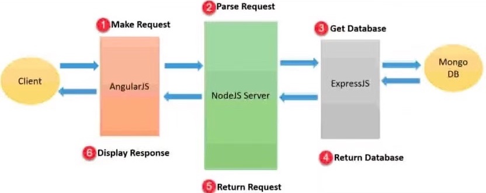
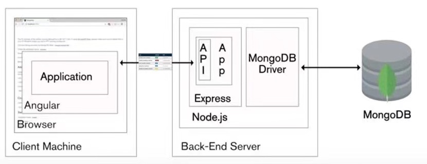

# System Implementation

## Contents

* [Stack architecture and system design](#_stack)
    * [Sequence diagram](#_sequence)
    * [Class diagram](#_class)

* [Back End - MongoDB - database implementation](#_backend)

* [Middle Tier - Express, Node, the RESTful API](#_middle)
    * [Document for API](#_api)

* [Front End - Angular](#_frontend)
    * [List of components](#_list)

* [Deployment details - Docker](#_deploy)

## Stack architecture and system design

We worked on a quiz challenge single page application that comprises of animation interaction to make the learning process more fun. After discussion of function and implementation, we decided to choose MEAN stack to develop the application in terms of its benefit of flexibility, scalability and extensibility. 

The client side is the web page which runs in the browser. On the client, we use Angular to render the content in JS and complete client-side operations.

As for backend, we use Node, Express and MongoDB for the serving of pages, the business logic and storage. We make requests over RESTful APIs and pass data in JSON format between the client and server.
  

  &nbsp;
  

  

### Sequence diagram

### Class diagram

## Back End - MongoDB - database implementation

In the MEAN stack, MongoDB stores the application’s data. When in production we host MongoDB in a container on the same server. We also have a local version for development and testing.

## Middle Tier - Express, Node, the RESTful API

Node.js is the backbone of the MEAN stack. We choose Express as a web application framework for Node.js. We use Express to handle all the interactions between the frontend and the database, ensuring a smooth transfer of data to the end user.

### Document for API
We build up three APIs in api.js file to operate data between frontend and backend. Read our REST API documents for details.
* [Document for submit API](submit_api.md)
* [Document for question API](question_api.md)
* [Document for report API](report_api.md)

## Front End - Angular

We use AngularJS to build the user-facing side of the application.

We use Angular components to amend the HTML, styling and logic for user interface which is rendered. After designing the function of the application, we build three main components to define areas of responsibility in the user interface. Each component controls a patch of screen view. We interact with these views via properties and methods contained within those components.

### List of components
The following table lists the components we design and create. Then we develop frontend web pages based on these components.

| No.  | Page      | Component   | Implementation                                                                   | Binding event (request or function) |
| ---- | --------- | ----------- | -------------------------------------------------------------------------------- | ----------------------------------- |
| 1    | index     | intro       | Text box, the content is fixed in html                                           | ----------------------------------- |
| 2    | index     | start-exam  | Start answer button                                                                                                | 
| 3    | question  | principle   | 1. Text box, the content is obtained from json 2. After the confirm button is triggered, display code principle |
| 4    | question  | option      |
| 5    | question  | confirm     |
| 6    | question  | getreport
| 7    | question  | status-bar
| 8    | question  | history
| 9    | report    | report
| 9    | report    | goback

## Deployment details - Docker

To improve portability and ease deployment, we use Docker to manage the Node/Mongo environment and ensure that others can easily recreate our production system.
