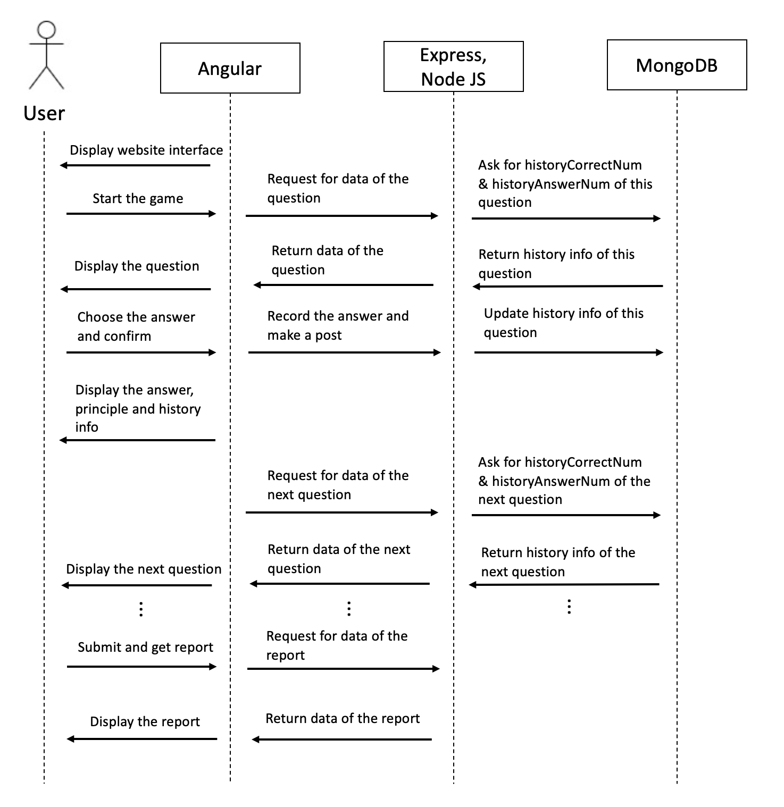
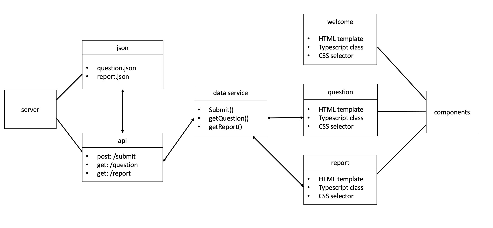

# System Implementation

## Contents

* [1. Stack architecture and system design](#_stack)
    * [Sequence diagram](#_sequence)
    * [Class diagram](#_class)

* [2. Back End - MongoDB - database implementation](#_backend)
    * [Data model and how to assemble json](#_model)

* [3. Middle Tier - Express, Node, the RESTful API](#_middle)
    * [RESTful API](#_api)
    * [Connect component to API](#_connect)
    * [Technical challenge](#_problem)

* [4. Front End - Angular](#_frontend)
    * [List of components](#_list)

* [5. Additional element - cookie/session or local storage](#_additional)

* [6. Deployment details - Docker](#_deploy)
    * [Frontend with static data](#_6.1)

<a name="_stack"></a>
## 1.  Stack architecture and system design

We worked on a quiz challenge single page application that comprises of animation interaction to make the learning process more fun. After discussion of function and implementation, we decided to choose MEAN stack to develop the application in terms of its benefit of flexibility, scalability and extensibility. 

The client side is the web page which runs in the browser. On the client, we use Angular to render the content in JS and complete client-side operations.

As for backend, we use Node, Express and MongoDB for the serving of pages, the business logic and storage. We make requests over RESTful APIs and pass data in JSON format between the client and server.
<br/><br/>
<p float="left">
  &nbsp;
  
</p>
<br/><br/>

<a name="_sequence"></a>
### - Sequence diagram


<a name="_class"></a>
### - Class diagram
We create three main components "welcome", "question" and "report" to render related pages and process business logic. We also create a data service to fetch and modify data between server and frontend. Read the following sessions for detail of each part.



<a name="_backend"></a>
## 2.  Back End - MongoDB - database implementation

In the MEAN stack, MongoDB stores the application’s data. When in production we host MongoDB in a container on the same server. We also have a local version for development and testing.
<a name="_model"></a>
### - Data model and how to assemble json

Data format of the project was set early from API documenting stage. However, for backend, the problem is where to store and get those json data.

Two ways are available, static data or use mongo DB. Obviously, we can use mongo DB to store everything and get everything. This is simple and easy to implement. However, there are things that are fixed for the project, like the content of a question and shit-code principles. Data like this is more appropriate to be static data.

The final design decision we make is to only store history answer message in the database. Fixed data is stored in server side as .json file. When there is a request for question, we use require(‘xx.json’) to get a json template, use mongo DB to get history info, and then assemble them together. This also happens when we assemble a report json data.

By doing this, we make the best use of mongo DB, static data is separated from dynamic ones. Determined by the complexity of the website, only one model is needed to record all history info of different users’ answers, see as below.

```javascript
var QuestionSchema = new Schema({
   questionId: Number,
   numOfAnswer: Number,
   numOfCorrect: Number
});
```

<a name="_middle"></a>
## 3.  Middle Tier - Express, Node, the RESTful API

Node.js is the backbone of the MEAN stack. We choose Express as a web application framework for Node.js. We use Express to handle all the interactions between the frontend and the database, ensuring a smooth transfer of data to the end user.

Since the whole project takes a separated front-end and back-end method to implement. Early confirmation of API interface and data model becomes really vital. This part is finished by back-end team so that front-end team can focus more on displaying. 

<a name="_api"></a>
### - RESTful API
Our group use the Express framework for our APIs. We build up three main APIs in `api.js` file to operate data between frontend and backend. These APIs originally came from paper prototyping stage where we explored further into what kind of action/url and data models the website need. 
Read the following API documents for details.
* [Document for `submit` API](submit_api.md)
* [Document for `question` API](question_api.md)
* [Document for `report` API](report_api.md)

API documents had only some little change over the implementing process. To be specific, only some details of json data were changed. This allows the whole team being quite efficient when implementing.

<a name="_connect"></a>
### - Connect component to API
We define a service to handle the http calls and hook it up to our application components. In the service, we create function `getQuestion()` and `getReport()` to make the right call to our APIs.
```javascript
  public getQuestion(id: number){
    const url = this.REST_API_QUESTION + id;
    return this.httpClient.get(url);
  }
```

```javascript
  public getReport(correctNum: number){
    const url = this.REST_API_REPORT + correctNum;
    return this.httpClient.get(url);
  }
```

<a name="_problem"></a>
### - Technical challenge
There are two major problems the backend team met. 

First, how to get params from a get request. In the workbook, only get request without any params was taught, but our project needs more than that. For example, a get question request will need to clarify which question the user asks for.

After doing some research into HTTP protocol and express framework, we finally figured out how to use express to get params and deal with it in api.js. A small piece of code below shows how we get `id` from a get request.

```javascript
if (req.query.id !== undefined){
   questionId = parseInt(req.query.id);
}
```

Second, there is a post request in the API design, which submits the information of whether user answered a specific question correctly. This request can sure be changed to a get request but the request will have influence on the database, so we think get request can be dangerous. Malicious attack can make use of get request to ruin the validity of data inside database, which is designed to provide history answering info.  

We used post request so that every data the server needs hides safely in request body instead of url. Also, this practice cost us some more time on understanding a post request and how to get param from request body.

<a name="_frontend"></a>
## 4.  Front End - Angular

We use AngularJS to build the user-facing side of the application.

We use Angular components to amend the HTML, styling and logic for user interface which is rendered. After designing the function of the application, we build three main components to define areas of responsibility in the user interface. Each component controls a patch of screen view. We interact with these views via properties and methods contained within those components.
<a name="_list"></a>
### - List of components
The following table lists the components we design and create. Then we develop frontend web pages based on these components.

| No.  | Page      | Component   | Implementation                                                                | Binding event<br>(request or function)    |
| ---- | --------- | ----------- | ----------------------------------------------------------------------------- | ----------------------------------------- |
| 1    | index     | intro       | Text box, the content is fixed in html                                        |                                           |
| 2    | index     | start-exam  | Start answer button                                                           | /question?id=                             |
| 3    | question  | principle   | 1. Text box, the content is obtained from json<br>2. After the confirm button is triggered, display code principle |      |
| 4    | question  | option      | 1. Text box, selectable (highlighted), the content is obtained from json<br>2. After the confirm button is triggered, trigger the animation according to the result |     |
| 5    | question  | confirm     | 1. Confirm button<br>2. Bind click, pop up assert if option is not selected<br>3. After clicking, verify and record the answer, trigger the animation<br>4. At the end of the animation, jump to the next question<br>5. Automatic submission after the last question |updateAnswers()<br>feedbackAnswer()<br>/report?correctNum= |
| 6    | question  | getreport   | 1. Get report button<br>2. Bind click, pop up assert if option is not selected<br>3. After clicking, verify and record the answer, trigger the animation | updateAnswers()<br>feedbackAnswer() |
| 7    | question  | status-bar  | 1. Unordered list, buttons for question numbers<br>2. Highlight according to the completion process | /question?id=       |
| 8    | question  | history     | 1. Text or image<br>2. Display history info, obtained from json<br>3. Stay hidden when answering a question, display after click 'confirm' |    |
| 9    | report    | report      | Text box, the content is obtained from json |   |
| 10   | report    | goback      | Button, return to the question page |   |


<a name="_additional"></a>
## 5.  Additional element - cookie/session or local storage

In the project, we tried to avoid the user to repetitively answer the questions, so session technic and local storage were taken into consideration.

Session can be seen as some memory on the server side while cookie is on client side. Session is designed to have limited survival time, so it is not what we want. By contrast, cookie can be a better choice, living on client side so user can take advantage of it to tell the server that the user has already done the questions once. However, cookie is carried to the server every time there is a http request, which put some pressure on the server side.

Our group finally chose local storage, which also lives permanently on client side but doesn't engage in client-server communication, exactly what we wanted.

<a name="_deploy"></a>
## 6.  Deployment details - Docker

To improve portability and ease deployment, we use Docker to manage the Node/Mongo environment and ensure that others can easily recreate our production system.

There are basically 4 stages of deployment.

<a name="_6.1"></a>
### - Frontend with static data
Frontend team make use of static json data declared in `component.ts` file to imitate data from backend (that is why early API documenting helps with developing). So once router and html file was finished, `ng serve` help testing the web page without any backend code. An example of static data used in frontend is showed below.

```javascript
public data: any = {
   questionId: 1,
   principle: 'shitcode one: use variable name with no actual meaning',
   realPrinciple: 'coding rule one: use variable with valid meaning',
      options: [{
         optionId: 1,
         content: 'int i = 0',
      },
      {  
         optionId: 2,
         content: 'int numOfStudent = 0',
      }],
      correctId: 2,
      historyCorrectNum: 5,
      historyAnswerNum: 10
};
```
### - Backend with no view
For backend team, coding is only about sending out the right json data since we are using RESTFUL API style. A small problem is how to test a post request without any frontend code. A tool called `postman` did great help as it can simulate all kinds of `http request` without frontend. 


