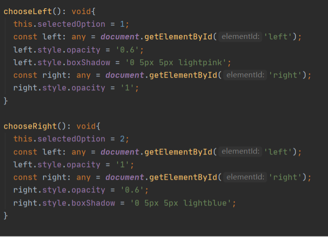

# System Implementation

## Contents

* [1. Stack architecture and system design](#_stack)
    * [Sequence diagram](#_sequence)
    * [Class diagram](#_class)

* [2. Back End - MongoDB - database implementation](#_backend)
    * [Data model and how to assemble json](#_model)

* [3. Middle Tier - Express, Node, the RESTful API](#_middle)
    * [RESTful APIs](#_api)
    * [Connect components to APIs](#_connect)
    * [Technical challenge](#_problem)

* [4. Front End - Angular - details of implementation](#_frontend)
    * [List of components](#_list)
    * [Welcome page](#_welcome)
    * [Question page](#_ques)
        * [Implementation of component I (principle, option and status-bar)](#_ques1)</br>
          - [HTML file](#_ques1.1)
          - [Typescript file](#_ques1.2)
        * [Implementation of component II (confirm button, get-report button, history)](#_ques2)
          - [Implementation of confirm button](#_ques2.1)
          - [Implementation of get-report button](#_ques2.2)
          - [Implementation of history block](#_ques2.3)
          - [Implementation of animation](#_ques2.4)
        * [Implementation of UI](#_ques3)
          - [Theme color](#_ques3.1)
          - [Navigation Bar](#_ques3.2)
          - [Nav box & Option selected style](#_ques3.3)
          - [Button cursor & Font](#_ques3.4)
    * [Report page](#_report)

* [5. Additional element - cookie/session or local storage](#_additional)

* [6. Deployment details - Docker - continuous integration](#_deploy)
    * [Develop frontend with static data](#_6.1)
    * [Develop backend with no view](#_6.2)
    * [Integrate frontend and backend](#_6.3)
    * [Deploy with docker and improve through testing](#_6.4)

<a name="_stack"></a>
## 1.  Stack architecture and system design

We worked on a quiz challenge single page application that comprises of animation interaction to make the learning process more fun. After discussion of function and implementation, we decided to choose **MEAN stack** to develop the application in terms of its benefit of flexibility, scalability and extensibility. 

The client side is the web page which runs in the browser. On the client, we use Angular to render the content in JS and complete client-side operations.

As for backend, we use Node, Express and MongoDB for the serving of pages, the business logic and storage. We make requests over RESTful APIs and pass data in JSON format between the client and server.
<br/><br/>
<p float="left">
  &nbsp;
  
</p>
<br/><br/>

<a name="_sequence"></a>
### - Sequence diagram
The application is designed and provides service according to the following sequence logic.


<a name="_class"></a>
### - Class diagram
We create three main components "welcome", "question" and "report" to render related pages and process business logic. We also create a data service to fetch and modify data between server and frontend. Read the following sessions for detail of each part.


</br>

<a name="_backend"></a>
## 2.  Back End - MongoDB - database implementation

In the MEAN stack, MongoDB stores the application’s data. When in production we host MongoDB in a container on the same server. We also have a local version for development and testing.

In the project, we only store dynamic history info (history correct number and history answer number) of each question in MongoDB. We don't store any sensitive information from users. The static question info is stored in the form of json in the server.

<a name="_model"></a>
### - Data model and how to assemble json

Data format of the project was set early from API documenting stage. However, for backend, the problem is where to store and get those json data.

Two ways are available, static data or use mongo DB. Obviously, we can use mongo DB to store everything and get everything. This is simple and easy to implement. However, there are things that are fixed for the project, like the content of a question and shit-code principles. Data like this is more appropriate to be static data.

The final design decision we make is to only store history answer message in the database. Fixed data is stored in server side as .json file. When there is a request for question, we use require(‘xx.json’) to get a json template, use mongo DB to get history info, and then assemble them together. This also happens when we assemble a report json data.

By doing this, we make the best use of mongo DB, static data is separated from dynamic ones. Determined by the complexity of the website, only one model is needed to record all history info of different users’ answers, see as below.

```javascript
var QuestionSchema = new Schema({
   questionId: Number,
   numOfAnswer: Number,
   numOfCorrect: Number
});
```
</br>

<a name="_middle"></a>
## 3.  Middle Tier - Express, Node, the RESTful API

Node.js is the backbone of the MEAN stack. We choose Express as a web application framework for Node.js. We use Express to handle all the interactions between the frontend and the database, ensuring a smooth transfer of data to the end user.

Since the whole project takes a separated front-end and back-end method to implement. Early confirmation of API interface and data model becomes really vital. This part is finished by back-end team so that front-end team can focus more on displaying. 

<a name="_api"></a>
### - RESTful APIs
Our group use the Express framework for our APIs. We build up three main APIs in `api.js` file to operate data between frontend and backend. These APIs originally came from paper prototyping stage where we explored further into what kind of action/url and data models the website need. 
Read the following API documents for details.
* [Document for `submit` API](submit_api.md)
* [Document for `question` API](question_api.md)
* [Document for `report` API](report_api.md)

API documents had only some little change over the implementing process. To be specific, only some details of json data were changed. This allows the whole team being quite efficient when implementing.

<a name="_connect"></a>
### - Connect components to APIs
We define a service to handle the http calls and hook it up to our application components. In the service, we create function `getQuestion()`, `getReport()` and `submitAnswer()` to make the right call to our APIs.

```javascript
  public REST_API_QUESTION = 'http://localhost:3000/api/question?id=';
  public REST_API_REPORT = 'http://localhost:3000/api/report?correctNum=';
  public REST_API_SUBMIT = 'http://localhost:3000/api/submit';
```

```javascript
  public getQuestion(id: number){
    const url = this.REST_API_QUESTION + id;
    return this.httpClient.get(url);
  }
```

```javascript
  public getReport(correctNum: number){
    const url = this.REST_API_REPORT + correctNum;
    return this.httpClient.get(url);
  }
```

```javascript
  public submitAnswer(answer: any) {
    console.log('post request sent');
    console.log(answer);
    return this.httpClient.post(this.REST_API_SUBMIT, answer, this.httpOptions);
  }
```

<a name="_problem"></a>
### - Technical challenge
There are two major problems the backend team met. 

First, how to get params from a get request. In the workbook, only get request without any params was taught, but our project needs more than that. For example, a get question request will need to clarify which question the user asks for.

After doing some research into HTTP protocol and express framework, we finally figured out how to use express to get params and deal with it in api.js. A small piece of code below shows how we get `id` from a get request.

```javascript
if (req.query.id !== undefined){
   questionId = parseInt(req.query.id);
}
```

Second, there is a post request in the API design, which submits the information of whether user answered a specific question correctly. This request can sure be changed to a get request but the request will have influence on the database, so we think get request can be dangerous. Malicious attack can make use of get request to ruin the validity of data inside database, which is designed to provide history answering info.  

We used post request so that every data the server needs hides safely in request body instead of url. Also, this practice cost us some more time on understanding a post request and how to get param from request body.

</br></br>

<a name="_frontend"></a>
## 4.  Front End - Angular - details of implementation

We use AngularJS to build the user-facing side of the application.

We use Angular components to amend the HTML, styling and logic for user interface which is rendered. After designing the function of the application, we build three main components to define areas of responsibility in the user interface. Each component controls a patch of screen view. We interact with these views via properties and methods contained within those components.

<a name="_list"></a>
### - List of components
The following table lists the components we design and create. Then we develop frontend web pages based on these components.

| No.  | Page      | Component   | Implementation                                                                | Binding event<br>(request or function)    |
| ---- | --------- | ----------- | ----------------------------------------------------------------------------- | ----------------------------------------- |
| 1    | welcome   | intro       | Text box, the content is fixed in html                                        |                                           |
| 2    | welcome   | start-exam  | Start answer button                                                           | /question?id=                             |
| 3    | question  | principle   | 1. Text box, the content is obtained from json<br>2. After the confirm button is triggered, display code principle |      |
| 4    | question  | option      | 1. Text box, selectable (highlighted), the content is obtained from json<br>2. After the confirm button is triggered, trigger the animation according to the result |     |
| 5    | question  | confirm     | 1. Confirm button<br>2. Bind click, pop up assert if option is not selected<br>3. After clicking, verify and record the answer, trigger the animation<br>4. At the end of the animation, jump to the next question<br>5. Automatic submission after the last question |updateAnswers()<br>feedbackAnswer()<br>/report?correctNum= |
| 6    | question  | getreport   | 1. Get report button<br>2. Bind click, pop up assert if option is not selected<br>3. After clicking, verify and record the answer, trigger the animation | updateAnswers()<br>feedbackAnswer() |
| 7    | question  | status-bar  | 1. Unordered list, buttons for question numbers<br>2. Highlight according to the completion process | /question?id=       |
| 8    | question  | history     | 1. Text or image<br>2. Display history info, obtained from json<br>3. Stay hidden when answering a question, display after click 'confirm' |    |
| 9    | report    | report      | Text box, the content is obtained from json |   |
| 10   | report    | goback      | Button, return to the question page |   |

</br>

<a name="_welcome"></a>
### - Welcome page
For the welcome page, it mainly lies in making the page design simple and easy to understand and how to match the logo.
Since the theme of the game is to find out shitcode, we use cute shit elements to layout the webpages. We found 47 images and finally selected the most popular ones with users.
For the design of the theme color, it is based on yellow, and the same color scheme is used in the following pages to keep the color of the website consistent.

<a name="_ques"></a>
### - Question page

<a name="_ques1"></a>
### Implementation of component I (principle, option and status-bar)

<a name="_ques1.1"></a>
* **HTML file**

Basically, we use ngfor to create 10 buttons and make them bound with 10 questions respectively. We use floating to make 2 option boxes (called button in html file) which show the question contents distributed horizontally. On top of the option box, there is a title to tell the user which is shit code and which is good code after the user makes a choice. It is empty at the begining and it shows appropriate contents by dom operation written in `question.compontent.ts` file. Besides, there is a footer at the bottom of the option box to show a feedback to the user. As for principles, we use `fadeInOut module` to make real principle appear at appropriate time.


<a name="_ques1.2"></a>
* **Typescript file**

The logic of status bar is to jump between questions, by clicking a specific button, the user can jump to a specific question directly. Besides, when the user finished a question, the bar should tell the user whether he or she has made a right choice with corresponding icons.

To implement it, every button on the bar is binding to the function showed in the picture below. This function aim to get the corresponding data from API, and by dom operation, the webpage will display new data.


Shit-code principle should be visible while the webpage is loaded, while real principle is displayed to the user after he or she makes a choice. This is implemented by `fadeInOutAnimation module`. Whether the user has answered the question is set to a variable called `isAnswered`. By judging the status of the variable, the webpage can decide when the real principle will be displayed.

In terms of questions, every question has two options and the user can choose one of them. After the user chooses an option, we need to tell the user which one is shit-code and show a feedback according to the chosen option. This is implemented mainly by `dom` operation. The function showed below will be called in `confirm() function`, therefore it can achieve the effect we want.


Besides, to record the user’s answers, an `array` is established in local storage and it is initialised to be an array of -1 which represent the question is not answerd yet. Every time when the user submit the answer, the array will change the value at corresponding position. In our rules, 0 represents wrong and 1 represents right. Finally the array will be sent to API, then we can get a report from API. During the process, the picture and background color of the navigator bar at corresponding position is also changed based on the user’s choice.


Last but not least, each time a new question is loaded, the title and the footer of the question button would be reset and the variable that represents whether this question is answerd or not would also be reset. The functions are showed as below.


</br>

<a name="_ques2"></a>
### Implementation of component II (confirm button, get-report button, history)

<a name="_ques2.1"></a>
* **Implementation of confirm button**

According to our design in previous section, we need two buttons: `confirm` & `get report` to submit answer, load next question and jump to report page. 

Firstly let’s take a look at confirm button. Click event is binding to the <button>, when the user clicks in the <button>, Angular executes the `confirmAnswer()` expression.

```html
<button id= "confirm" type="button" (click)="confirmAnswer()">confirm</button>
```
In the method of `confirmAnswer()`, an `if` statement determines which state of the clicked button is staying (`confirm`/`next`). The function `document.getElementById()` is to get element in the template by the id. If the state is `confirm`, a check for option selected status is necessary, only after which the program is allowed to submit answer and display feedbacks. 

```typescript
confirmAnswer(): void {
    // if answered, jump to next question / report page
    const confirmNext: any = document.getElementById('confirm');
    if (confirmNext.innerHTML === 'next') {
      ……
    }
    // otherwise, confirm answer
    if (this.selectedOption === -1) {
      alert('please choose an answer!');
      return;
    }
    this.updateAnswer();
    this.feedbackAnswer();
}
```

The method of `updateAnswer()` modifies the state of `isAnswered` attribute, which is used as a controller for other features’ activity in the same component. 
The method `checkAnswer()` gets result of the answer and is stored in the `isCorrect` attribute. The result of the answer is submitted to the server through the `dataService`. It also worths mentioning that `submitAnswer()` is a synchronous approach to post answer to the server and then returns an observable object, so we need to subscribe this method.

```typescript
updateAnswer(): void {
  this.isAnswered = true;
  this.checkAnswer();
  this.dataService.submitAnswer(JSON.stringify(
    {questionId: this.data.questionId, isCorrect: this.isCorrect})).subscribe();
}
```

The method of feedback change the text inside `confirm` button to be replaced by `next`. Therefore, when user clicks this button again, the `next` function in `confirmAnswer()` method is now activated for use. 
Before request for loading next question data, it is necessary to check if it is at the end of all questions and determine whether the page should jump to the report page directly.

```typescript
feedbackAnswer(): void {
const confirmNext: any = document.getElementById('confirm');
confirmNext.innerHTML = 'next';
}

confirmAnswer(): void {
    // if answered, jump to next question / report page
    const confirmNext: any = document.getElementById('confirm');
    if (confirmNext.innerHTML === 'next') {
      if (this.data.questionId === 10) {
        this.getReport();
      } else {
        this.loadQuestion(this.data.questionId + 1);
      }
      return;
    }
……
}
```

<a name="_ques2.2"></a>
* **Implementation of get-report button**

Then let’s look at the `get report` button. The click event is also binding to this button, and Angular executes the method `getReport()` when the button is clicked. Different from `confirm` button, the `[disabled]` is an attribute of the template. When the state of `isAnswered` is false, the button functionality is banned (i.e. when clicked, no response) until the question is answered.
The `setTimeout()` method hold on `getReport()` method for 2s before it responds to jump to report page.

```html
<button id= "report" [disabled]="!isAnswered" type="button" (click)="getReport()">get report</button>
```

```typescript
getReport(): void{
  // disabled until it is answered
  if (this.isAnswered) {
    setTimeout(() => {
      this.router.navigate(['/report']); }, 2000);
  }
}
```

<a name="_ques2.3"></a>
* **Implementation of history block**

History block refers to the statistical data of all answer records in a question. In the template, history message is a paragraph with embedding `getAccuracy()` method as interpolation. Angular first evaluates the expression, and then converts to a string.
`[hidden]` is an attribute of the template, which will hide the whole `<div></div>` block when the question is not answered.

```html
<div [@fadeInOut]="isAnswered ? 'Answered':'notAnswered'" [hidden]="!isAnswered">
    <p class="history">{{getAccuracy()}} people find the shit code!</p>
</div>
```

```typescript
getAccuracy(): string {
  if (this.data.historyCorrectNum === 0 || this.data.historyAnswerNum === 0){
    return '0%';
  }
  return (Math.round(this.data.historyCorrectNum / this.data.historyAnswerNum * 10000) / 100.00) + '%';
}
```

<a name="_ques2.4"></a>
* **Implementation of animation**

In order to re-use the animations and facilitate the management of animations, we are defining the animations in a separate file. To make the appear and disappear of principles and history messages more smooth and naturally, we use `fade in` & `fade out` animation. The `notAnswered => Answered` transition sets an initial opacity of 0, and then animates it to change that opacity to 1 as the element is inserted into the view. 

```typescript
import {animate, animateChild, group, query, state, style, transition, trigger} from '@angular/animations';
export const fadeInOutAnimation =
  // fade in & fade out animation + fixed position
  trigger('fadeInOut', [
    state('notAnswered', style({ opacity: 0 })),
    state('Answered', style({ opacity: 1 })),
    transition('notAnswered => Answered', [
      animate('500ms')
    ]),
    transition('Answered => notAnswered', [
      animate('500ms')
    ])
  ]);
```

To make the animation definition available in our application, we adding the reusable animation (`fadeInOutAnimation`) to the animations metadata of the component.

```typescript
import {fadeInOutAnimation} from '../../animations';
@Component({
  selector: 'app-question',
  templateUrl: './question.component.html',
  styleUrls: ['./question.component.css'],
  animations: [
    fadeInOutAnimation
  ]
})
```

To enable router animation, firstly, we add the data property of each route to define the key animation-specific configuration associated with a route. In the file of `app-routing.module.ts`:

```typescript
const routes: Routes = [
  {path: 'welcome', component: WelcomeComponent, data: {animation: 'WelcomePage'}},
  {path: 'question', component: QuestionComponent, data: {animation: 'QuestionPage'}},
  {path: 'report', component: ReportComponent, data: {animation: 'ReportPage'}},
  {path: '**', redirectTo: 'welcome'},
];
```

Secondly, we need to tell the Angular router where to render the views when matched with a route. Here, the `prepareRoute()` method takes the value of the outlet directive (established through `#outlet="outlet"`) and returns a string value representing the state of the animation based on the custom data of the current active route. In the component of `app-component`:

```html
<div [@routeAnimations]="prepareRoute(outlet)" class="content" role="main">
  <router-outlet #outlet="outlet"></router-outlet>
</div>
```

```typescript
import {RouterOutlet} from '@angular/router';
import {slideInAnimation} from './animations';
@Component({
  selector: 'app-root',
  templateUrl: './app.component.html',
  styleUrls: ['./app.component.css'],
  animations: [
    slideInAnimation
  ]
})
export class AppComponent {
  title = 'shitcode';
  // tslint:disable-next-line:typedef
  prepareRoute(outlet: RouterOutlet) {
    return outlet && outlet.activatedRouteData && outlet.activatedRouteData.animation;
  }
}
```

Finally, we define animations in the file of `animation.ts`. It’s too long so here we emit the later part which repeats the definition except for the transition statement.

```typescript
export const slideInAnimation =
  trigger('routeAnimations', [
    transition('WelcomePage => QuestionPage', [
      style({ position: 'relative' }),
      query(':enter, :leave', [
        style({
          position: 'absolute',
          top: 0,
          left: 0,
          width: '100%'
        })
      ]),
      query(':enter', [
        style({ left: '100%' })
      ]),
      query(':leave', animateChild()),
      group([
        query(':leave', [
          animate('100ms ease-out', style({ left: '-100%' }))
        ]),
        query(':enter', [
          animate('300ms ease-out', style({ left: '0%' }))
        ])
      ]),
      query(':enter', animateChild()),
    ]),
    transition('QuestionPage <=> ReportPage',[
      ……
    ]) 
]);
```

</br>

<a name="_ques3"></a>
### Implementation of UI

Until now our website can work though it is ugly, so the last step is to improve the user interface. Like changing the background color of the website, changing the pictures of the navigator bar, changing font style of the principles, etc. These are implemented in `question.component.ts` file by dom operation.

<a name="_ques3.1"></a>
* **Theme color**

We define a 10-element array as an attribute to store background colors for each question. Every time the question page is reloaded, the program will change its theme color depends on the current question ID.

```typescript
private themeColors: any[] = ['#FEC89A', '#FFD7BA', '#FCD5CE', '#FAE1DD', '#E8E8E4', '#D8E2DC', '#ECE4DB', '#FFE5D9',
  '#FFD7BA', '#FEC89A'];
document.body.style.backgroundColor = this.themeColors[id - 1];
```

<a name="_ques3.2"></a>
* **Navigation Bar**

The idea in UI implementation of navigation bar, is to replace the inner text of question number and background color of each navigation box, with images that can represent different answer status. Therefore, we alter the `ngAfterViewInit()` method and `checkAnswer()` method, to get the sub elements in the template and change the source of images as well as box background color according to the answer status of a question (correct, wrong, default).

```typescript
private stateColors: any = {correct: '#FFA000', wrong: 'red', default: ''};

ngAfterViewInit(): void {
	……
// init nav bar with different status colors & img
for (i = 0; i < 10; i++) {
  console.log((i + 1).toString());
  const navBox: any = document.getElementById((i + 1).toString());
  if (this.answerStatus[i] === 1) {
    navBox.style.backgroundColor = this.stateColors.correct;
    navBox.childNodes[0].src = '../../../assets/img/nav/good.png';
  } else if (this.answerStatus[i] === 0) {
    navBox.style.backgroundColor = this.stateColors.wrong;
    navBox.childNodes[0].src = '../../../assets/img/nav/bad.png';
  } else {
    navBox.style.backgroundColor = this.stateColors.default;
    navBox.childNodes[0].src = '../../../assets/img/nav/default.png';
  }
}
}

checkAnswer(): void {
  let color: string;
  let imgUrl: string;
  this.isCorrect = this.selectedOption === this.data.correctId;
  if (this.isCorrect){
    color = this.stateColors.correct;
    imgUrl = '../../../assets/img/nav/good.png';
    this.answerStatus[this.data.questionId - 1] = 1;
  } else{
    color = this.stateColors.wrong;
    imgUrl = '../../../assets/img/nav/bad.png';
    this.answerStatus[this.data.questionId - 1] = 0;
  }
  localStorage.setItem('answerStatus', JSON.stringify(this.answerStatus));
  const navBox: any = document.getElementById(this.data.questionId.toString());
  navBox.style.backgroundColor = color;
  navBox.childNodes[0].src = imgUrl;
}
```

<a name="_ques3.3"></a>
* **Nav box & Option selected style**

The idea to highlight selected option and navigation box is using the change of opacity. Opacity of 0.6 refers to the unselected state, while opacity of 1 is considered as the selected state. After loading the question data, it highlights the navigation box which it is located in.

```typescript
// to highlight current navBox
this.questionIDArray.forEach(item => {
  const navBox: any = document.getElementById(item.toString());
  navBox.style.opacity = '0.6';
  if (item === id){
    navBox.style.opacity = '1';
  }
});
```

As for the option selected style, because the selected status needed to be retained when reviewing an answered question, but be cleared when go to an unanswered question. However, the option selected status of last question would be maintained if not reset it timely. Therefore, we reset the option status right after we load the question. 

```typescript
resetAnswerState(): void{
   …
   // reset selected status
   const left: any = document.getElementById('left');
   const right: any = document.getElementById('right');
   left.style.opacity = '0.6';
   right.style.opacity = '0.6';
}

retainAnsweredState(id: number): void{
   this.isAnswered = true;
   // retain selected status
   this.isCorrect = this.answerStatus[id - 1] === 1;
   const optionIdSet = [2, 1];   // a trick to return 1 when input 2, and vice versa
   this.selectedOption = this.isCorrect ? this.data.correctId : (optionIdSet.indexOf(this.data.correctId) + 1);
   this.selectedOption === 1 ? this.chooseLeft() : this.chooseRight();
   // reset & generate feedback
   this.resetOptionFeedback();
   this.feedbackAnswer();
}
```

We change the opacity of the option box when the user has made a choice.



We also use box shadow when the user hovers the mouse on the bar or the option. 


<a name="_ques3.4"></a>
* **Button cursor & Font**

For user-friendly reasons, it’s better to change mouse style from pointer to not-allowed logo as well as to make the color gray when the button is disabled. Here are a CSS solutions to it.

```css
[disabled]{
  opacity: 0.7;
  cursor: not-allowed;
}
```

To make our UI more harmonized, we have tried multiple solutions of font, and finally decide to adopt `Josefin Sans` series font for the body of our webpage. Here are the attempts that we have made about the font design.

```css
.font{
 /* font-family: "Brush Script MT", cursive;
  font-family: Georgia, serif;
  font-family: Garamond, serif;*/
  //font-family: 'Architects Daughter',serif;
  /*font-family: 'Amatic SC',serif;
  letter-spacing: 3px;*/
  //font-family: 'Exo 2',serif;
  font-family: Josefin Sans, serif;
}
```

</br>

<a name="_report"></a>
### - Report page

On the report page, the score is displayed with related shit-mood logo according to the accuracy. 

```javascript
<div *ngIf="data.accuracy>=80">
   
</div>
<div *ngIf="data.accuracy>=60 && data.accuracy<80">
   
</div>
<div *ngIf="data.accuracy<60">
   
</div>
```

There are buttons on the bottom linked to review the answers, return to the home page, and try again the game.

```javascript
<div>
   <a class="button" routerLink="/question">review answers</a>
   <a class="button" routerLink="/welcome">home</a>
   <a class="button" routerLink="/question" (click)="clearAnswers()">replay</a>
</div>
```
</br>

<a name="_additional"></a>
## 5.  Additional element - cookie/session or local storage

In the project, we tried to avoid the user to repetitively answer the questions, so session technic and local storage were taken into consideration.

Session can be seen as some memory on the server side while cookie is on client side. Session is designed to have limited survival time, so it is not what we want. By contrast, cookie can be a better choice, living on client side so user can take advantage of it to tell the server that the user has already done the questions once. However, cookie is carried to the server every time there is a http request, which put some pressure on the server side.

Our group finally chose local storage, which also lives permanently on client side but doesn't engage in client-server communication, exactly what we wanted.
</br></br>

<a name="_deploy"></a>
## 6.  Deployment details - Docker - continuous integration

To improve portability and ease deployment, we use Docker to manage the Node/Mongo environment and ensure that others can easily recreate our production system.

There are basically 4 stages of deployment.

<a name="_6.1"></a>
### - Develop frontend with static data
Frontend team make use of static json data declared in `component.ts` file to imitate data from backend (that is why early API documenting helps with developing). So once router and html file was finished, `ng serve` help testing the web page without any backend code. An example of static data used in frontend is showed below.

```javascript
public data: any = {
   questionId: 1,
   principle: 'shitcode one: use variable name with no actual meaning',
   realPrinciple: 'coding rule one: use variable with valid meaning',
      options: [{
         optionId: 1,
         content: 'int i = 0',
      },
      {  
         optionId: 2,
         content: 'int numOfStudent = 0',
      }],
      correctId: 2,
      historyCorrectNum: 5,
      historyAnswerNum: 10
};
```

<a name="_6.2"></a>
### - Develop backend with no view
For backend team, coding is only about sending out the right json data since we are using RESTFUL API style. A small problem is how to test a post request without any frontend code. A tool called `postman` did great help as it can simulate all kinds of `http request` without frontend. 


<a name="_6.3"></a>
### - Integrate frontend and backend
Once both frontend and backend team finished the same feature (for example report component and report API were finished), Git helped with merge codes. Therefore, it keeps both team aware of each other’s progress and integrate several parts at a time.

In the real process, the backend managed to finish earlier than the frontend. From that time on, frontend team can have a real backend to test their code, so no more separated coding is needed.

<a name="_6.4"></a>
### - Deploy with docker and improve through testing
Although we are advised to use docker while developing, there are three important reasons our team chose to do things slightly differently. First, deploy by docker functions no differently from running website on IDE(in our team, WebStorm) locally and is actually more complex and slowly. Second, docker takes up more and more space in the computer as we continue to build and run. Third, using a local mongoDB is easier for debugging since we can check things directly through its terminal, see as below.

```javascript
const url = `mongodb://${MONGO_USERNAME}:${MONGO_PASSWORD}@${MONGO_HOSTNAME}:${MONGO_PORT}/${MONGO_DB}?authSource=admin`;
//const url = `mongodb://127.0.0.1:27017/questions?authSource=admin`;
```

Our final decision is to develop locally until we have a fully functioning website and only do user testing on docker. Docker provide quite reliable support when we tried to test and improve through wide user testing. Simple `docker-compose build` and `docker-compose up` did the whole job of modify and redeploy.
</br></br>

[Back to the homepage](../../README.md)
