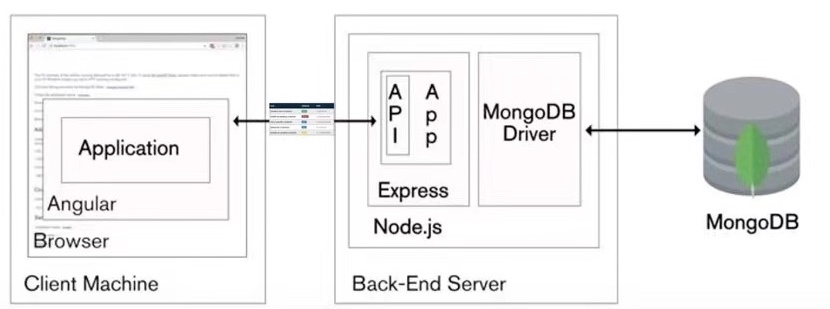

# System Implementation

## Contents

## Stack architecture and system design

We worked on a quiz challenge single page application that comprises of animation interaction to make the learning process more fun. After discussion of function and implementation, we decided to choose MEAN stack to develop the application in terms of its benefit of flexibility, scalability and extensibility. 

The client side is the web page which runs in the browser. On the client, we use Angular to render the content in JS and complete client-side operations.

As for backend, we use Node, Express and MongoDB for the serving of pages, the business logic and storage. We make requests over RESTful APIs and pass data in JSON format between the client and server.
  

  

  
