# UX Design

## Contents

* [1. Early prototyping and ideation](#_1)
    * [Early ideation and mood boards](#_1.1)
    * [Paper prototyping](#_1.2)
    
* [2. Identification of interacting users and broader stakeholders](#_2)
    * [End user - coding novice](#_2.1)
    * [End user - coding lover](#_2.2)
    * [Broader stakeholder - online coding community](#_2.3)
    
* [3. UX approach](#_3)
    * [Design thinking](#_3.1)
    * [Prototyping and think-loud](#_3.2)
    
* [4. Understanding of user group](#_4)
    * [User story 1: Emma (coding novice)](#_4.1)
    * [User story 2: Max (coding lover)](#_4.2)
    * [User story 3: Raymond (active user of online coding community)](#_4.3)

* [5. Wireframes and interaction flow diagrams for final key subsystems](#_5)
    * [Wireframe: welcome page](#_5.1)
    * [Wireframe: question page](#_5.2)
    * [Wireframe: report page](#_5.3)
    * [Interaction flow diagrams for final key subsystems](#_5.4)


<a name="_1"></a>
## 1. Early prototyping and ideation

<a name="_1.1"></a>
### - Early ideation and mood boards

We brainstormed a list of several forms of game, like kicking a ball, gambling, rolling dice, trading. We also listed several serious topics, like garbage sorting to protect environment, finding buying partner to share order and reduce waste, shit-code tutorial to help new coder get rid of bad coding habit.
Then we created a matrix to populate the axes with these play items and problems for further decision.

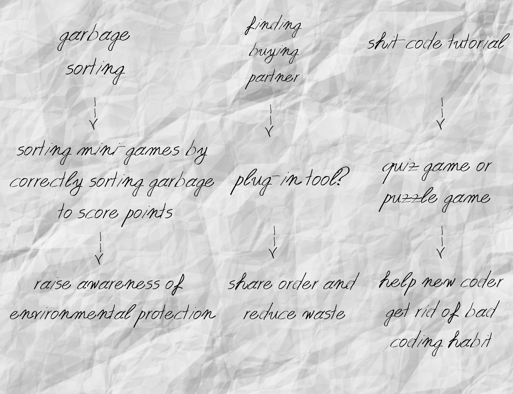

After several rounds of discussion and voting, we finally chose the idea about shitcode which is very close to our current situation and needs. Having found that most learning is by trying out challenging problems and reflecting on them, we decided to design a quiz game to address the problem about bad coding habit and promote active learning experience.

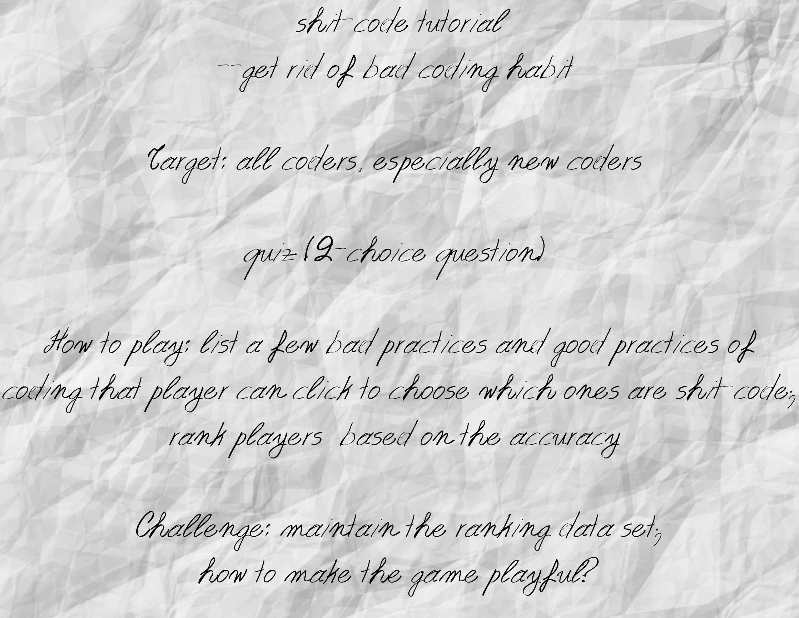

<a name="_1.2"></a>
### - Paper prototyping

[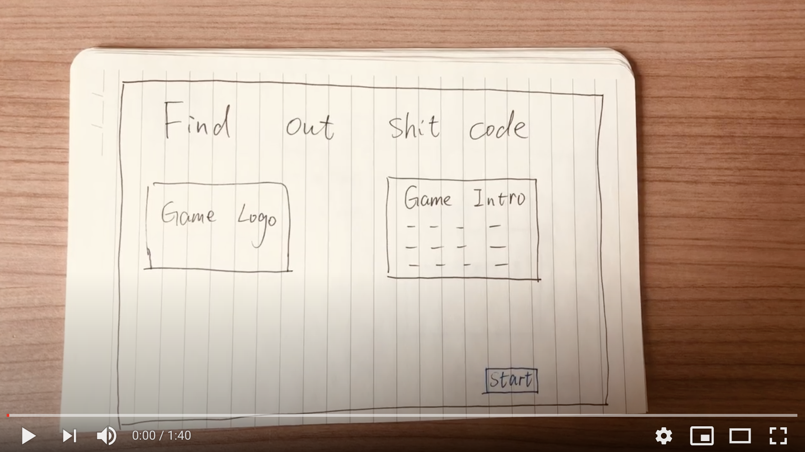](https://youtu.be/6ovaOIM6iVE)

</br>

<a name="_2"></a>
## 2. Identification of interacting users and broader stakeholders

Our system is mainly designed for two types of end user: coding novice and coding lover. Online coding community is also our broader stakeholder.

<a name="_2.1"></a>
* **End user - coding novice**<br/>
The coding novice is a group of people who are new to programming, like computer science related students. They are in the process of systematically learning programming. As a beginner, they need to learn good practice of coding in order to build up good coding habit at the beginning.

<a name="_2.2"></a>
* **End user - coding lover**<br/>
The coding lover is a group of people who have much interest in coding but not major in it or work on it. They may like to study coding by themselves in their free time and their main tutorial might be materials online. The game is a good supplement to their self-study.

<a name="_2.3"></a>
* **Broader stakeholder - online coding community**<br/>
Developers tend to like discussing problems they meet in an online coding community. So there is much coding experience in practice that could be found in those online communities. This could be a good example for teaching which is good code and identifying which is shit code, which would be a good source to enrich database of quiz questions.

</br>

<a name="_3"></a>
## 3. UX approach

A UX approach involves deeply understanding the users through research, organizing information, visual design (and more), all with the goal of meeting user needs and doing it elegantly. It involves putting users at the centre of the design and development process, and establishing an iterative cycle of research, design and evaluation.

* **Research**<br/>
Perform initial user research to help understand the target audience (capabilities, limitations, goals, expectations) and their tasks.
* **Design**<br/>
User research insights are used to help generate ideas and early designs. Prototyping can be used to bring concepts to life.
* **Evaluation**<br/>
Capture user feedback, and to measure the delivered UX throughout a project.

We used the following approaches to improve our UX design in the whole process of development.

<a name="_3.1"></a>
### - Design thinking

To design and build a web app that is based around the concept of “serious play” which addresses a serious issue but using playful techniques to engage audiences, we used **design thinking** to generate the idea of our project. 

During design thinking, we followed the process as below.
* **Discover**<br/>
Discover a real-world problem or a serious issue around us. Speak to people who are affected by the issues.
* **Define**<br/>
Define the challenge of the problems gathered from the discovery phase in a different way.
* **Develop**<br/>
Give different answers to the clearly defined problem, seeking inspiration from elsewhere.
* **Deliver**<br/>
Test out different solutions at small-scale, reject those that will not work and improve the ones that will.

<a name="_3.2"></a>
### - Prototyping and think-loud

Paper prototyping is a user-centred design method that involves the development of user interface mock-ups and drawn sketches which are presented to end users for evaluation.

We involved our users to better conceptualise our product and visualise how it will be used. Feedback from **end-user Emma** is listed as below.
* **Product concept and goals**<br/>
```I think it's very clear for the game to choose out shitcode in order to get scores as high as possible.```
* **Logic and flow of user journeys**<br/>
```I think the logic of the game is very simple to understand, easy to play.```
* **The form of the user interface**<br/>
```Using cute shit elements and images to display result of my answer to each question is very vivid and fits the shit-code theme.```

This really tested our hypothesis and helped us to better understand our product and users.

</br>

<a name="_4"></a>
## 4. Understanding of user group

User story is a popular way to record user needs. To make the picture clear, we identify and introduce the following three typical user stories through interviewing related people around us.

<a name="_4.1"></a>
### - User story 1: Emma (coding novice)

```As a freshman majoring in computer science, I just start my journey on coding. I feel exciting but also nervous. I could learn technical skills and algorithm from books. However, this is a very practical subject. Sometimes, I didn't get high score for my assignments and feel frustrated on the reality that my code is a little messy compared with others. I want to figure out how to write elegant and efficient code, so that I could be a solid and professional software engineer in the future. I know this requires accumulation of much experience, but it would be better if there is tutorial or guidance about that somewhere. There are many tutorials on the market about how to write code using specific programming language. I expect more there would be tutorials about teaching me how to write readable, stable, sustainable and robust code to solve problems elegantly. ```

If there is a game that requires you to find out shit code, how do you feel about it? Would you like to try? What's your expectation for it?

```I find that would be interesting. I'm willing to try. There is nothing better than learning in the game. I love puzzle game! I expect if I find out shit code in the game, I could definitely avoid it in my work. I think that might be like a mirror to remind me what to do and what not to do when writing code.```

<a name="_4.2"></a>
### - User story 2: Max (coding lover)

```As an amateur programmer, I learn coding by myself at my spare time and I'm always willing to explore more. The internet is a knowledge treasury for my self-study. I could always find good tutorials online. However, I also wonder how to write code more professionally. I could find some summaries of coding experience from others online. It would be more excellent if there is more guidance and conclusion on how to write professional code on the internet.```

If there is a game that requires you to find out shit code, how do you feel about it? Would you like to try? What's your expectation for it?

```Oh, play a game about coding? That sounds fun. I definitely would try. I hope I could learn something from that and reflect on whether I write similar stupid shit code in my own practice.```

<a name="_4.3"></a>
### - User story 3: Raymond (active user of online coding community)

```I'm a professional software engineer and also an active user on Stack Overflow. I appreciate the culture of sharing on the internet. As a developer, I'm willing to share my coding knowledge and experience with others. I am eager to provide debugging support and help others solve coding problems on Stack Overflow. It's also an opportunity for me to increase my coding skills. However, Stack Overflow is more like BBS. It would be great and more helpful for coding learner if posted issues in online coding community could be tagged and further categorized.```

If there is a game that you could play to find out shit code, how do you feel about it? Would you like to contribute some shit codes for the database of this quiz game?

```I think it would be a great game, right? As a software engineer, one of our main principles is to avoid writing any shit codes. I'm willing to contribute any shit code I meet from my daily work or online coding community like Stack Overflow. It's a good idea to share and improve everyone's coding level through a simple game. Learning from fun is one of beliefs I hold as a developer. As the saying goes, interest is the best teacher. I can't agree more.```

</br>

<a name="_5"></a>
## 5. Wireframes and interaction flow diagrams for final key subsystems

The development of wireframes of each page is according to user's feedback in different phases.

<a name="_5.1"></a>
### - Wireframe: welcome page

The welcome page is to display the game theme and logo as well as introduce what the game is and how to play with it. 

The initial design of welcome page is drawn as below.


The final design of welcome page is show as below. Click ``"play"`` button to start the game.

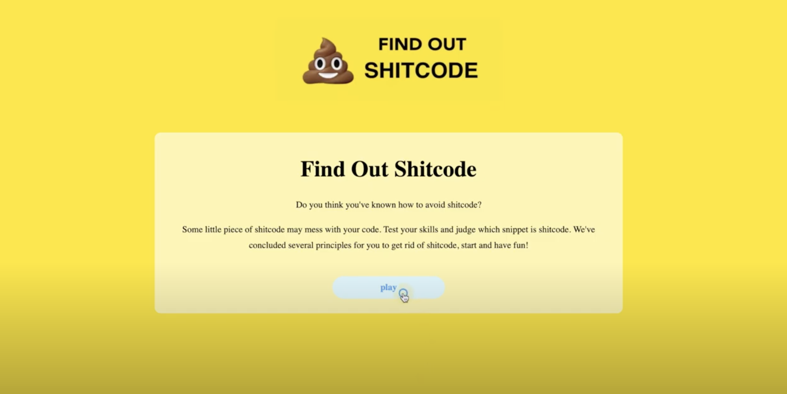

<a name="_5.2"></a>
### - Wireframe: question page

The question page is to show quiz questions and right answer of each question after a player choose an option.

The initial design of question page is drawn as below.


The first version of question page is show as below.
- There is navigation bar on the top to show the progress and answering status.
- The shitcode rule/type is a hint for the current question.
- The player should choose one answer from two option boxes.

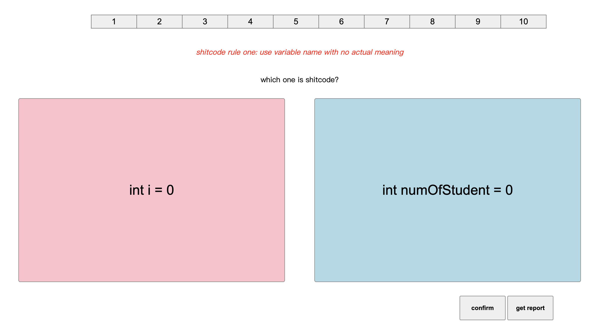

The final version of question page is show as below. It renders color of the page and adds cute shit logo on the navigation bar.

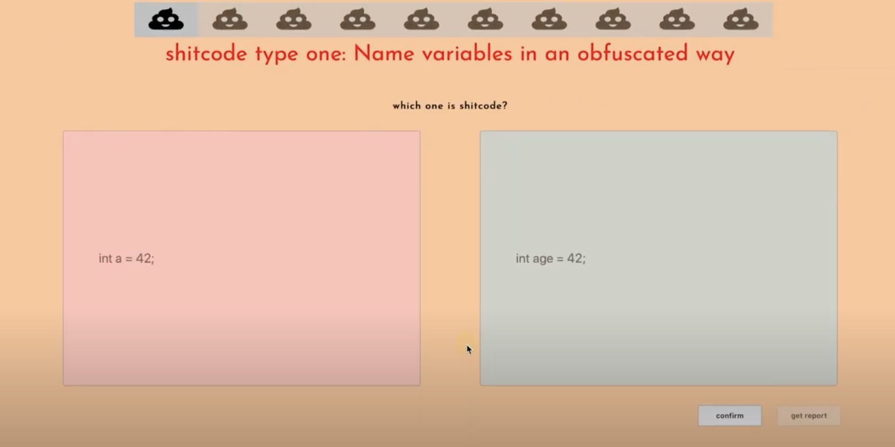

The option box chosen by player will be highlighted as below.

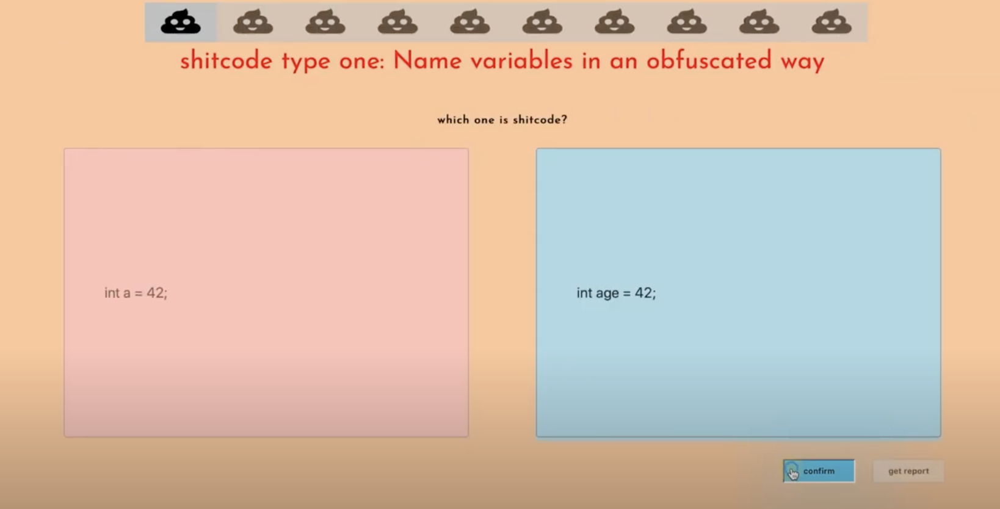

If the player don't choose an answer but directly click "confirm" button, a prompt box will pop up to give a reminder.

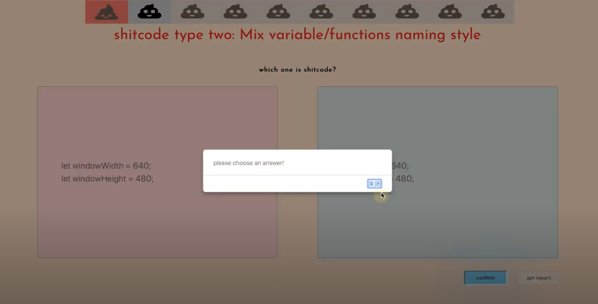

After confirming, the page will show 
- the right answer which will be highlighted
- the right coding rule for reference
- the updated navigation which display the answering status of this question (correctly answered questions and incorrectly answered questions have different icons)

The initial design is drawn as below.


The first version is show as below.

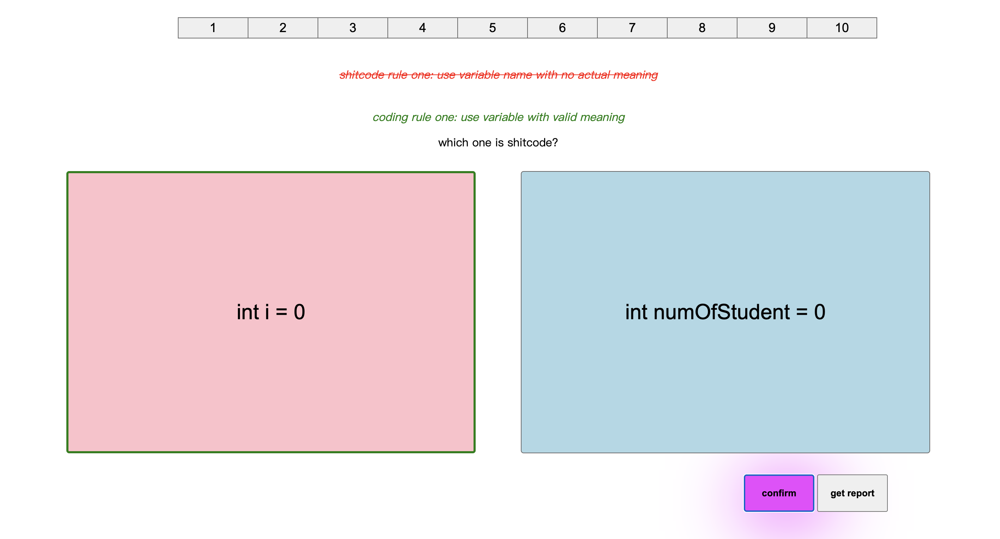

The final version is show as below which has much more detail with more vivid UI design.

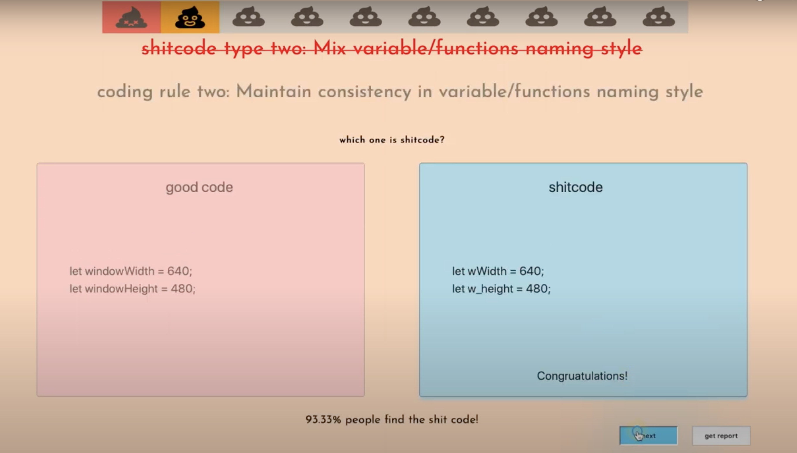

The player could also click the specific question number on the navigation bar to skip some questions but answer a particular one first. The player has complete freedom to choose which question to answer first. The grey icons on the navigation bar in the following picture indicate unanswered questions.

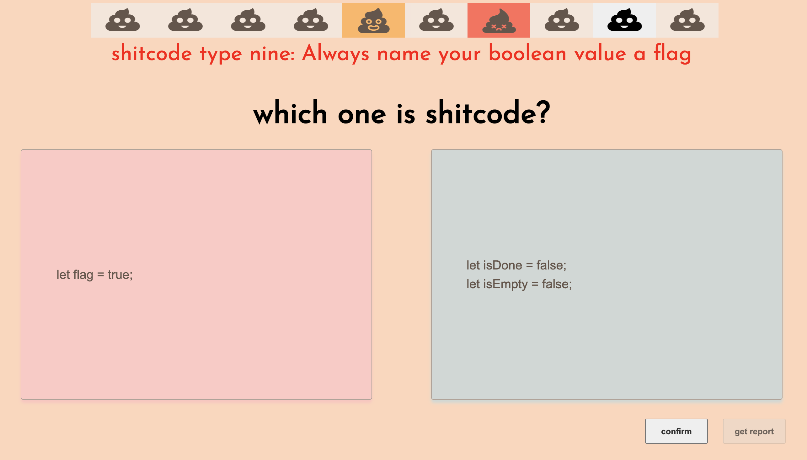

Then click "next" button to go into next question or "get report" button to end answering the rest of questions and enter to the report page in advance. When the last question is answered, "get report" button has to be clicked to enter to the report page. 

<a name="_5.3"></a>
### - Wireframe: report page

The report page is to show the result and performance of the player with three button to choose next step. 

The initial design of report page is drawn as below.


The final design of report page is shown as below.

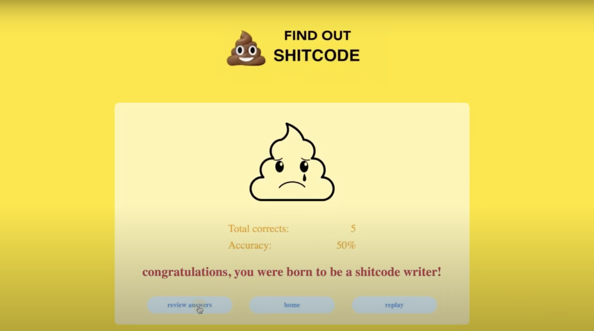

- Click "replay" button to restart the game, which would clear your performance record in your current report.
- Click "home" button to come back to the welcome page. If you click "play" button again, the question pages will show you existed previous answering state of yours. You could click "get report" button, then "replay" button on the report page to replay the game if you want.
- Click " review answers" button to come back to the question pages to check the answer of each question. You could click "next" button to check one by one. Or you could click specific questions on the navigation bar to check the ones that you answer incorrectly before, which shows as below.

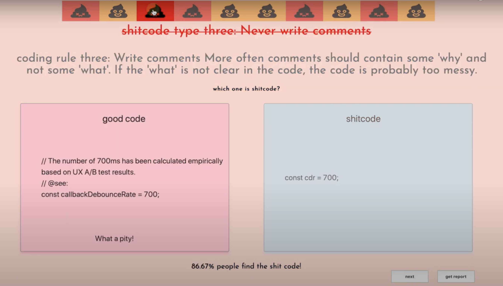

<a name="_5.4"></a>
### - Interaction flow diagrams for final key subsystems

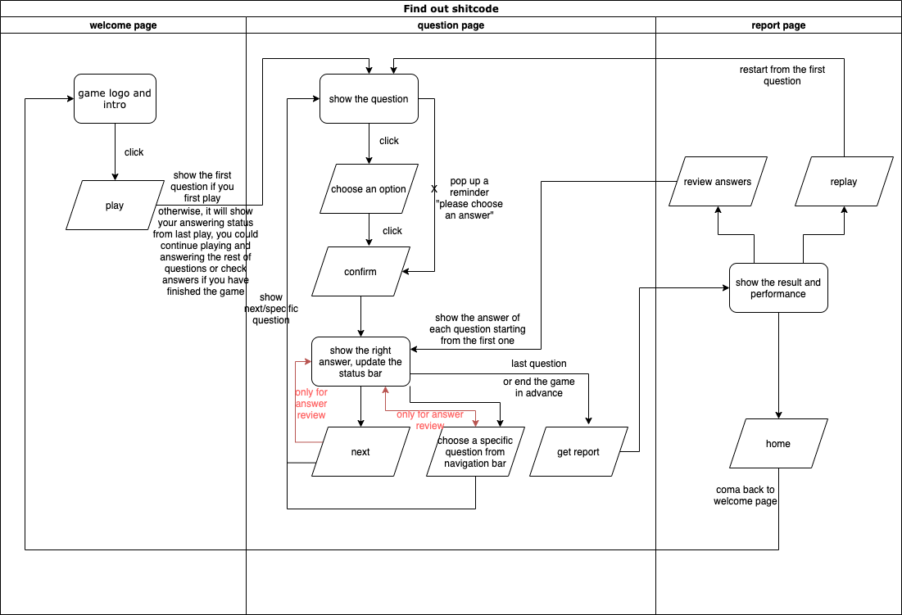


</br></br>

[Back to the homepage](../../README.md)
